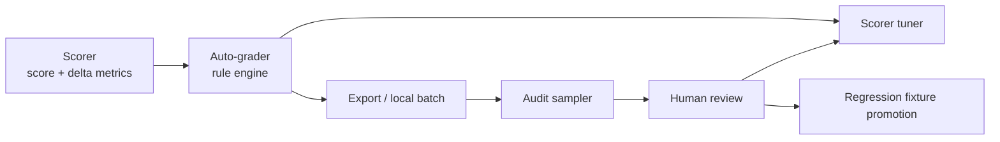

# Auto-Grader Design

## Context

The current calibration workflow is fast, but it still frames the problem as "is the scorer output okay?" and then stores a human-adjusted `final_ok`.

That framing breaks down when the automation needs to become the primary operational supervision layer:

- `autoAssess()` in `tools/calibration.jsx` emits a scalar `ok` plus issue ids.
- `tools/run_calibration.py` needs directional signals, but contradictory issue sets already appear in real dogfooding.
- Human time is too scarce to directly supervise every scorer output.

The design goal is therefore:

- scorer produces raw metrics and score,
- `auto-grader` produces structured verdicts about that score,
- human review audits the `auto-grader`,
- scorer tuning consumes the `auto-grader`,
- and the interfaces remain compatible with later probabilistic and uncertainty-aware upgrades.

## Design Principles

- Humans audit the grader, not the scorer directly.
- The grader is interpretable first: every verdict must be traceable to rule ids and underlying signals.
- Contradiction yields `abstain`, not forced direction.
- Small random audits are mandatory because biased queues do not reveal blind spots.
- Architecture must support later probabilistic aggregation without renaming core concepts.
- Specs should stay thin until interfaces harden; the design layer owns the evolving rationale and architecture.

## Current State

Today:

- `tools/calibration.jsx` synthesizes cases, scores them with the shared scorer, and exports structured `auto_grader`, `default_verdict`, `final_verdict`, and review provenance.
- `tools/run_calibration.py` evaluates `population`, `challenge`, and `regression` profiles, then uses a gate-then-optimize search for scorer selection and release gating.

Observed failure modes from the March 30 dogfooding export:

- Most reviewed disagreements were `auto ok -> human wrong`.
- Contradictory issue combinations already occur in the same row.
- Misses cluster in same-hue or same-family saturation / brightness failures and moderate hue drift that the scorer rewards too generously.

Implication:

- The main remaining work is calibration quality and audit coverage, not inventing a new supervision abstraction from scratch.
- The right direction is still a better `auto-grader` interface, but the local v1 architecture is now far enough along to support alpha release gating.

## Stable Concepts

These terms should remain stable even if v1 later upgrades to a label model, uncertainty calibration, or stronger evaluators.

| Concept | Meaning now | Why it stays stable later |
|---|---|---|
| `auto_grader` | The local system that turns scorer outputs into structured judgments | Later versions may change the combiner, not the role |
| `verdict` | `too_high`, `too_low`, `ok`, or `abstain` | Stable top-level judgment space |
| `rules` | The explicit rule ids that fired | Needed for traceability and later probabilistic aggregation |
| `signals` | Numeric and derived features the rules reason over | Supports debugging, rule learning, and later instance-aware aggregation |
| `confidence` | Coarse confidence band in v1, calibrated quantity later | Lets the interface evolve without schema churn |
| `abstain` | Explicit no-decision because signals conflict or coverage is poor | Required for selective escalation and calibrated routing |
| `human_review` | Audit record about the auto-grader verdict | Human role stays meta-eval even as internals evolve |
| `sampling_bucket` | Why the example entered review or evaluation | Keeps audit statistics honest and supports weighted analysis later |
| `regression_fixture` | Locked audited example promoted into the non-regression suite | Stable bridge from collection to tests |

## Now: v1 Architecture

### Scorer

- Produces `score`, `delta_e`, `hue_dist`, `delta_l`, `delta_c`, and `delta_h`.
- Remains the thing being evaluated and tuned.

### Auto-grader

- Consumes scorer outputs and derived signals.
- Emits one of:
  - `too_high`
  - `too_low`
  - `ok`
  - `abstain`
- Always records:
  - fired `rules`
  - supporting `signals`
  - coarse `confidence`
  - whether the system abstained

### Audit sampler

- Selects which examples deserve human review.
- Must include both targeted and random sampling.

### Human review

- Audits the `auto-grader` verdict rather than directly labeling the scorer.
- Records agreement, override direction, and optional reason.

### Scorer tuner

- Tunes scorer parameters against non-abstaining `auto-grader` verdicts.
- Uses human review primarily to measure and improve grader quality.

### Regression fixture promotion

- Promotes selected audited examples into a locked suite.
- Protects both scorer behavior and grader behavior from regression.

## Now: v1 Rule Families

v1 should move from monolithic issue ids toward interpretable rule families.

### Directional `too_high` rule families

- Same-hue or near-same-hue cases with large saturation / brightness / lightness / chroma drift but still generous score.
- Same-family brightness misses that score in the middle or high range.
- Moderate hue drift that still receives a score that feels too forgiving.
- Clear wrong-family or far-family cases that still score too well.

### Directional `too_low` rule families

- Very close perceptual matches that receive only mediocre scores.
- Same-family cases where hue is clearly preserved but the score is harsher than intended.

### Non-directional / `abstain` rule families

- Conflicting signals such as near-zero hue distance combined with huge perceptual error.
- Sparse or underexplored regions where the rule engine should not force direction.
- Cases where multiple directional rule families fire in opposite directions.

### Contradiction handling

- If at least one `too_high` rule and one `too_low` rule fire, the verdict is `abstain`.
- Contradictory cases are prioritized for human audit.
- The tuner does not treat abstained cases as direct optimization targets.

## Now: Human Audit Model

Human review answers:

- did the `auto-grader` verdict make sense?
- if not, what should the verdict have been?
- was the example actually ambiguous enough that abstention would have been better?

The audit record should conceptually preserve:

- `human_review.status`
- `human_review.agrees_with_auto`
- `human_review.corrected_verdict`
- `human_review.reason`

This is intentionally different from storing only a final global `ok`.

## Now: Audit Policy

The review queue should mix five buckets:

- `hard_negative`: suspected bad scorer behavior
- `abstain`: contradictory or under-confident auto-grader cases
- `boundary_probe`: threshold-adjacent cases where small parameter changes matter
- `random_audit`: mandatory slice for blind-spot discovery and honest quality tracking
- `positive_sanity`: obvious or canonical positives to prevent over-harsh grading

Queue policy:

- Prioritize `abstain` and historically noisy rule families.
- Keep `random_audit` mandatory in every review cycle.
- Revisit rule families with high human disagreement, not only fresh examples.

## Now: Evaluation

### Auto-grader quality

Primary metrics:

- audited agreement rate, stratified by `sampling_bucket`
- directional precision for `too_high` and `too_low`
- abstain rate
- abstain disagreement rate
- rule-family overturn rate
- random-audit blind-spot discovery count

Important limitation:

- Biased audit queues are operationally useful, but they are not unbiased population estimates.
- Headline quality claims should eventually come from random audits or weighted estimators, not only targeted review queues.

### Scorer quality

Primary metrics:

- rate at which scorer outputs satisfy non-abstaining `auto-grader` verdicts
- post-change disagreement on the random audit slice
- regression fixture pass rate

## Critical Scenarios

### Auto-grader emits a directional verdict and human agrees

- The row strengthens confidence in that rule family.
- The example is eligible for scorer tuning and possible fixture promotion.

### Auto-grader emits a directional verdict and human overrides

- The event counts against grader quality first.
- The scorer is not immediately treated as the only failure point.
- The rule family should be revised or split before using similar rows as strong tuning supervision.

### Multiple rules conflict and the grader abstains

- The example is prioritized for audit.
- The tuner skips it as a direct target.

### Random audit catches a blind spot

- This is evidence that the grader, not just the scorer, is under-modeled in that region.
- The outcome should usually add or revise a rule family before it is used as a tuning target at scale.

### Scorer tuning consumes grader outputs while humans audit grader quality

- This is the intended operating model.
- Human labels remain the supervisory layer for grading the grader.

### Future probabilistic aggregation replaces deterministic rule combination

- The top-level concepts do not change:
  - `auto_grader`
  - `verdict`
  - `rules`
  - `signals`
  - `confidence`
  - `abstain`
  - `human_review`
  - `sampling_bucket`

## Next: v1.5

- Add coarse confidence bands and better abstain thresholds.
- Track rule-family reliability explicitly.
- Add re-audit scheduling for noisy or high-disagreement rule families.
- Improve the runner to support both scorer tuning and auto-grader audit reporting as separate modes.

## Later: v2

- Replace deterministic rule combination with a probabilistic label model over rule outputs.
- Allow class-specific rule reliability and possibly instance-conditioned aggregation.
- Use weighted or importance-sampled audit summaries to estimate global quality with confidence intervals.
- Add stronger selective escalation policies inspired by selective evaluation work.

## Frontier: v3+

- Optional evaluator assistance for proposing rule families or drafting audit prompts.
- Optional stronger secondary evaluators behind explicit routing and human override.
- Confidence-calibrated guarantees on when the system can safely auto-grade without review.

## Boundary With Specs

- This doc owns rationale, architecture, stable concepts, and evolution path.
- Specs should only absorb hardened interfaces and shipped behavior once the export schema and runner contracts stabilize.
- Until then, the design layer is the right home because this feature is still conceptually moving fast.
